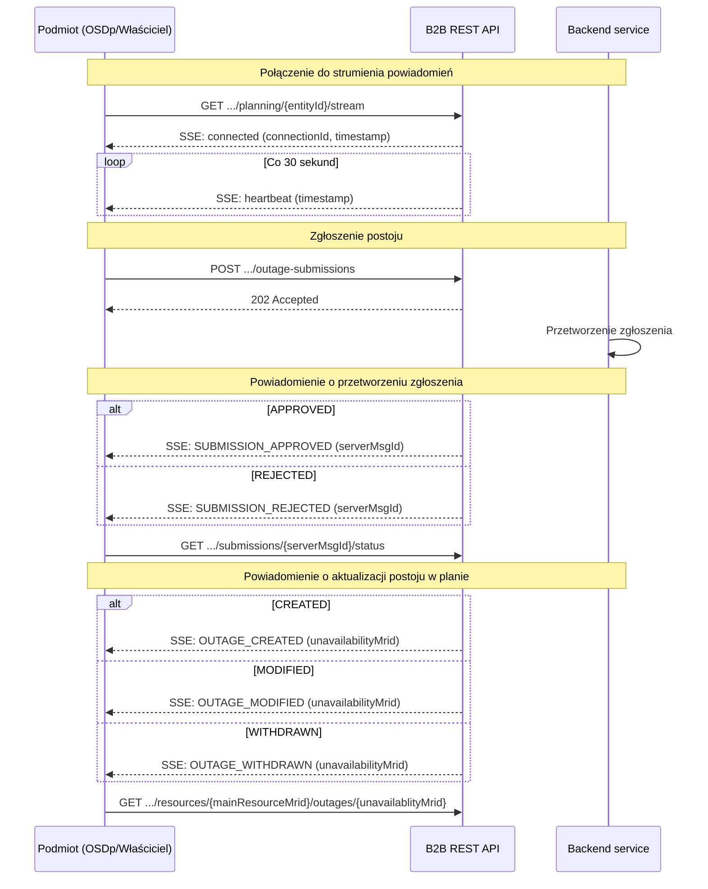
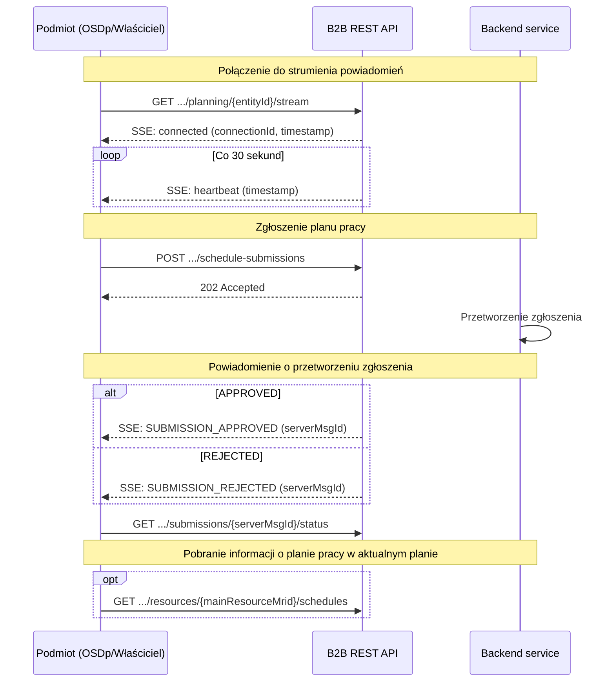

# WYMIANA DANYCH PLANISTYCZNYCH 

Poniżej przedstawiono specyfikację zakresu i formatu danych planistycznych wymienianych przez dedykowany system informatyczny OSP (kanał B2B). Specyfikacja opiera się na dokumencie „Zakres wymienianych danych dla potrzeb planowania pracy i prowadzenia ruchu KSE” (TCM - zakres wymienianych danych, opracowany na podstawie art. 40 ust. 5 SO GL) oraz na IRiESP. Dane wymieniane są pomiędzy OSP, OSD i SGU (znaczących użytkowników sieci) w procesach związanych z zarządzaniem pracą KSE w zakresie niezbędnym do bilansowania mocy KSE. Dane te są przesyłane w postaci komunikatów elektronicznych o ściśle określonym formacie. 

Korzystanie z kanału wymiany danych B2B wymaga od uczestniczących w wymianie informacji z OSP zarejestrowania się jako partner biznesowy OSP 
i uzyskania identyfikatora partnera biznesowego.

## Dokumenty źródłowe
Niniejsze standardy w zakresie wymiany danych planistycznych opierają się na następujących dokumentach po ich ostatnich zmianach:
* Dokument TCM „Zakres wymienianych danych dla potrzeb planowania pracy i prowadzenia ruchu KSE” (opracowany na podstawie art. 40 ust. 5 SO GL), opublikowany dnia 22 października 2025 r.
* Instrukcja Ruchu i Eksploatacji Sieci Przesyłowej (IRiESP) ze zmianami wynikającymi z Karty aktualizacji nr 3/CK-3/2025 do IRiESP, opublikowanej dnia 22 października 2025 r.

Oprócz tego standardy odnoszą się do dokumentów:
* Warunki Dotyczące Bilansowania (WDB) z dnia 14 września 2023 roku
* Standardy techniczne systemu SOWE wersja 9.0

## Specyfikacja OpenAPI
Pełna specyfikacja techniczna API dostępna jest w pliku: [`specs/planning-openapi.yml`](specs/planning-openapi.yml)

> Log zmian znajduje się w [CHANGELOG.md](CHANGELOG.md)

Dostępna jest również [dokumentacja API w formacie REDOC](https://polskie-sieci-elektroenergetyczne.github.io/planning-api/)
| Parametr | Wartość |
|----------|---------|
| **Adres bazowy** | `https://b2b.pse.pl` |
| **Ścieżka bazowa** | `/pwdp/api/v1/` |
| **Uwierzytelnianie** | mTLS — certyfikaty klienckie X.509 podpisane przez zaufany CA operatora |
| **Format danych** | JSON |

## Oznaczenia
W poniższym opisie oraz tabeli zastosowano następujące nazwy i oznaczenia:
* Obiekt generacji lub poboru – ogólne określenie obiektu, na który zgłaszane są dane dotyczące planowanej generacji lub poboru, albo też dane dotyczące dyspozycyjności. Są to zasoby: MWE, MEE, pompy.
* Obiekt wymiany – obiekt, na który zgłaszane są dane dotyczące planowanej wymiany nierównoległej poprzez sieć 110 kV. Są to linie wymiany bądź grupy linii wymiany.
* Właściciel – Wytwórca lub inny podmiot należący do znaczących użytkowników sieci (SGU), który jest właścicielem obiektu generacji lub poboru. Właściciela może również zastępować jednoznacznie określony inny podmiot, który pełni rolę przedstawiciela tego SGU.
* ZWE - Zakład Wytwarzania Energii,
* ESP - Elektrownia Szczytowo-Pompowa,
* PPM - MWE typu moduł parku energii,
* IWM – MWE hybrydowy, posiadający również składową o kategorii magazyn (tj. instalację magazynowania energii elektrycznej przyłączoną w jednym miejscu sieci elektroenergetycznej poprzez układ energoelektroniki) dla źródła energii pierwotnej, która wspiera pracę instalacji wytwórczej
* OREB - okres rozliczania energii bilansującej (pojęcie zdefiniowane w WDB).
* ZAK – znacznik aktywności na rynku bilansującym (pojęcie zdefiniowane w WDB).

 

## Ogólne zestawienie przekazywanych danych planistycznych

###	Zakres obiektów
Zakres obiektów, których dotyczy pozyskiwanie danych planistycznych w związku z wyżej wymienionymi zmianami dokumentów źródłowych obejmuje zarówno zasoby wytwórcze jak i umożliwiające realizację zdolności magazynowana energii. Ponieważ bloki energetyczne ESP mogą składać się albo z hydrozespołów odwracalnych, albo z oddzielnych generatorów i pomp, zatem obiektami, na kóre pozyskuje się dane planistyczne mogą być, odpowiednio do budowy bloków ESP: MWE lub pompy.

Pozyskiwanie danych planistycznych dotyczy obiektów:
* MWE (Moduły Wytwarzania Energii)
* Magazyny chemiczne MEE (Magazyn Energii Elektrycznej) – wyłącznie o mocy maksymalnej netto większej niż 50 kW
* Pompy – stanowiące część ZWE typu ESP
* Linie wymiany 

W ramach MWE mogą wystąpić MWE hybrydowe, tj. MWE, które są modułami parku energii (PPM): 
* posiadające jeden punkt przyłączenia do systemu przesyłowego lub systemu dystrybucyjnego,
* zawierające zestaw jednostek wytwarzających energię elektryczną z wykorzystaniem różnych źródeł energii pierwotnej, wykorzystujących do wytwarzania energii elektrycznej energię promieniowania słonecznego lub energię wiatru,
* posiadające technologię wytwarzania energii: Układ hybrydowy (źródła OZE o różnych technologiach wytwarzania)
* przyłączone do sieci w sposób niesynchroniczny lub poprzez układy energoelektroniki.

MWE hybrydowe mogą dodatkowo zawierać jednostkę umożliwiającą magazynowanie energii, która wspiera pracę instalacji wytwórczej, tworząc w ten sposób instalację wytwórczo-magazynową (IWM).

W przypadku MWE hybrydowych dane planistyczne są pozyskiwane na składowe tych MWE.

### Kanał komunikacji
Wymiana danych planistycznych odbywa się poprzez dedykowany kanał B2B, którym za pomocą zdefiniowanych komunikatów można zgłaszać dane odpowiednio do wymogów zawartych we wskazanych dokumentach źródłowych.
W ramach komunikacji kanałem B2B będzie zapewniona kontrola przesyłanych komunikatów ze zgłoszeniami w zakresie dopuszczalności ich przesyłania do Operatora Systemu Przesyłowego, poprawności struktury i formatu.

### Zakres danych planistycznych
Poniżej przedstawiono zakres danych planistycznych przekazywanych poprzez kanał B2B. Są to zarówno dane o charakterze grafikowym jak i dane okresowe, tj. niedyspozycyjności: postoje, ubytki i niesprawności układu regulacji. 

Zachowanie ciągłości informacji i jednokrotnego zgłaszania danych (w odniesieniu do kanału SOWE) dotyczy jedynie danych planistycznych (niedyspozycyjności) na zasób, gdzie jednostka grafikowa (JG = zasób) jest powiązana wyłącznie z tym zasobem oraz gdzie na ten zasób zgłasza się postoje i ubytki. W tej sytuacji zgłoszenie danych na zasób jednocześnie bezpośrednio dotyczy powiązanej JG. W przypadku powiązania wielu zasobów do jednej JG albo powiązania JG z jednym zasobem, w odniesieniu do którego zgłasza się harmonogramy dyspozycyjności, zgłoszenia na poszczególny zasób oraz na JG są traktowane niezależnie.

Dane planistyczne przekazywane są przez OSDp oraz poszczególnych właścicieli wypełniających obowiązki SOGL w porządku jak przedstawiono w poniższej tabeli. 

| Nadawca | Obiekt generacji lub poboru albo obiekt wymiany | Aktywność na rynku bilansującym | Rodzaj przekazywanych danych | 
|-----------| :---------: | :---------: |-----------|
|OSDp |	MWE typu B lub C w sieci OSDp	| Brak lub dowolny rodzaj JG poza JGW1 | Harmonogram dyspozycyjności przekazywany przez OSDp dla horyzontu od doby bieżącej do 5 lat (60 miesięcy) naprzód    Plan pracy przekazywany dla horyzontu dobowego (od doby bieżącej do doby d+9)    Polecenia ruchowe OSD dla horyzontu dobowego (od doby bieżącej do doby d+9) |
|OSDp | MWE typu B lub C w sieci OSDp | JGW1 | Harmonogram dyspozycyjności przekazywany przez OSDp dla horyzontu od doby bieżącej do 5 lat (60 miesięcy) naprzód |
| OSDp | MWE typu D w sieci OSDp | Brak lub dowolny rodzaj JG poza JGW1 | Niedostępność (postój, ubytek dodatni, ubytek ujemny) dla horyzontu od doby bieżącej do 5 lat (60 miesięcy) naprzód    Niesprawność regulacji pierwotnej, wtórnej lub ARNE (w przypadku świadczenia usług) od doby bieżącej do 5 lat (60 miesięcy) naprzód    Plan pracy MWE przekazywany dla horyzontu dobowego (od doby bieżącej do doby d+9) |
OSDp | MWE typu D w sieci OSDp | JGW1 | Niedostępność (postój, ubytek dodatni, ubytek ujemny) dla horyzontu od doby bieżącej do 5 lat (60 miesięcy) naprzód    Niesprawność regulacji pierwotnej, wtórnej lub ARNE (w przypadku świadczenia usług) od doby bieżącej do 5 lat (60 miesięcy) naprzód |
Właściciel	| MWE typu D w sieci OSP | Brak lub dowolny rodzaj JG poza JGW1 | Niedostępność (postój, ubytek dodatni, ubytek ujemny) dla horyzontu od doby bieżącej do 5 lat (60 miesięcy) naprzód    Niesprawność regulacji pierwotnej, wtórnej lub ARNE (w przypadku świadczenia usług) od doby bieżącej do 5 lat (60 miesięcy) naprzód    Plan pracy MWE przekazywany dla horyzontu dobowego (od doby bieżącej do doby d+9) |
Właściciel | MWE typu D w sieci OSP | JGW1 | Niedostępność (postój, ubytek dodatni, ubytek ujemny) dla horyzontu od doby bieżącej do 5 lat (60 miesięcy) naprzód    Niesprawność regulacji pierwotnej, wtórnej lub ARNE (w przypadku świadczenia usług) od doby bieżącej do 5 lat (60 miesięcy) naprzód | |
| OSDp | MEE w sieci OSDp | Dowolnie | Harmonogram dyspozycyjności przekazywany dla horyzontu od doby bieżącej do 5 lat (60 miesięcy) naprzód    Plan pracy MEE przekazywany dla horyzontu dobowego (od doby d do doby d+9)    Pojemność użytkowa MEE przekazywana dla horyzontu od doby bieżącej do 5 lat (60 miesięcy) naprzód    Polecenia ruchowe OSD dla horyzontu dobowego (od doby bieżącej do doby d+9) |
| Właściciel | MEE w sieci OSP | Dowolnie | Niedostępność (postój, ubytek dodatni, ubytek ujemny) dla horyzontu od doby bieżącej do 5 lat (60 miesięcy) naprzód    Niesprawność regulacji pierwotnej, wtórnej lub ARNE (w przypadku świadczenia usług) od doby bieżącej do 5 lat (60 miesięcy) naprzód    Plan pracy MEE przekazywany dla horyzontu dobowego (od doby d do doby d+9)    Pojemność użytkowa MEE przekazywana dla horyzontu od doby bieżącej do 5 lat (60 miesięcy) naprzód |
| Właściciel | pompa | Dowolnie | Niedostępność (postój, ubytek dodatni, ubytek ujemny) dla horyzontu od doby bieżącej do 5 lat (60 miesięcy) naprzód    Plan pracy pompy przekazywany dla horyzontu dobowego (od doby bieżącej do doby d+9) |
OSDp | Linia wymiany   Obiekt wymiany (grupa linii wymiany) | Nie dotyczy | Grafik planowanego salda wymiany nierównoległej realizowanej poprzez sieć 110 kV przekazywane przez OSDp dla horyzontu 5-letniego, rocznego i dobowego |

 

## Komunikaty i usługi
W ramach kanału B2B przewidziana jest komunikacja dwustronna. Jest to realizowane za pomocą Server-Sent Events (SSE) dla powiadomień oraz REST dla wymiany danych.
SSE uzupełnia komunikację REST o możliwość powiadamiania zgłaszająch OSDp i Właścicieli o zmianach statusu ich zgłoszeń oraz o zmianach niedyspozycyjności, które nastąpiły poza kanałem B2B.

### Zgłaszanie danych planistycznych (niedyspozycyjności oraz danych grafikowych)
Informacje biznesowe w kanale B2B są przekazywane w postaci komunikatów. Komunikat elektroniczny stanowi sformalizowany co do struktury oraz formatu zbiór danych przesyłanych jako komunikat na potrzeby wymiany informacji planistycznych dotyczących wymienionych wyżej zasobów.
Format komunikatów obowiązujących w kanale B2B jest zgodny ze standardem opisu JSON.

[Komunikat postoju](docs/komunikat%20zg%C5%82oszenia%20postoju.md)
                    
[Komunikat ubytku](docs/komunikat%20zg%C5%82oszenia%20ubytku.md)

[Komunikat niesprawności układu regulacji](docs/komunikat%20zgłoszenia%20niesprawności.md)

[Komunikat harmonogramu dyspozycyjności](docs/komunikat%20zgłoszenia%20harmonogramu%20dyspozycyjności.md)

[Komunikat pojemności użytkowej](docs/komunikat%20zgłoszenia%20pojemności%20użytkowej.md)

[Komunikat planu pracy](docs/komunikat%20zgłoszenia%20planu%20pracy.md)

[Komunikat poleceń ruchowych OSD](docs/komunikat%20zgłoszenia%20poleceń%20ruchowych%20OSD.md)

[Komunikat salda wymiany](docs/komunikat%20zgłoszenia%20salda%20wymiany.md)

### Powiadamianie o zmianie danych planistycznych
[Powiadomienia i odpowiedzi na zgłoszenia](docs/komunikat%20odpowiedzi.md)

### Udostępnianie danych planistycznych
[Plan niedostępności - postoje dla zasobu w zadanym okresie](docs/komunikat%20postoje.md)

[Plan niedostępności - ubytki dla zasobu w zadanym okresie](docs/komunikat%20ubytki.md)

[Plan niesprawności układów regulacji w zadanym okresie](docs/komunikat%20niesprawności.md)

[Harmonogram dyspozycyjności dla zasobu w zadanym okresie](docs/komunikat%20harmonogram%20dyspozycyjności.md)

[Pojemność użytkowa dla zasobu w zadanym okresie](docs/komunikat%20pojemność%20użytkowa.md)

[Plan pracy dla zasobu w zadanym okresie](docs/komunikat%20plan%20pracy.md)

[Polecenia ruchowe OSD dla zasobu w zadanym okresie](docs/komunikat%20polecenia%20ruchowe%20OSD.md)

[Saldo wymiany dla linii wymiany w zadanym okresie](docs/komunikat%20saldo%20wymiany.md)

 

### Usługi umożliwiające wymianę danych planistycznych
W celu realizacji procesu zgłaszania danych planistycznych udostępnione są niżej wymienione usługi (serwisy), szczegółowo opisane w ramach API. 

Serwisy umożliwiające zgłoszenie danych planistycznych:
* postój - /pwdp/api/v1/outage-submissions
* ubytek - /pwdp/api/v1/derate-submissions
* niesprawność układu regulacji - /pwdp/api/v1/control-malfunction-submissions
* harmonogram dyspozycyjności - /pwdp/api/v1/availability-submissions
* pojemność użytkowa - /pwdp/api/v1/storage-capacity-submissions
* plan pracy - /pwdp/api/v1/schedule-submissions
* polecenia ruchowe OSD - /pwdp/api/v1/dispatch-instruction-submissions
* saldo wymiany nierównoległej - /pwdp/api/v1/exchange-schedule-submissions

Serwisy udostępniające dane planistyczne:
* status przetwarzania zgłoszenia - /pwdp/api/v1/submissions/{serverMsgId}/status
* postoje dla zasobu w zadanym okresie - /pwdp/api/v1/resources/{mainResourceMrid}/outages
* ubytki dla zasobu w zadanym okresie - /pwdp/api/v1/resources/{mainResourceMrid}/derates
* niesprawności układu regulacji dla zasobu w zadanym okresie - /pwdp/api/v1/resources/{mainResourceMrid}/control-malfunctions
* harmonogram dyspozycyjności dla zasobu w zadanym okresie - /pwdp/api/v1/resources/{mainResourceMrid}/availabilities
* plan pracy dla zasobu w zadanym okresie - /pwdp/api/v1/resources/{mainResourceMrid}/schedules
* polecenia ruchowe OSD dla zasobu w zadanym okresie - /pwdp/api/v1/resources/{mainResourceMrid}/dispatch-instructions
* saldo wymiany nierównoległej dla zasobu w zadanym okresie - /pwdp/api/v1/resources/{mainResourceMrid}/exchange-schedules

 

### Statusy zgłoszeń
Zgłoszenia danych planistycznych są odbierane z kanału B2B i weryfikowane pod kątem poprawności formalnej i w podstawowym zakresie biznesowym. 

Po pozytywnym przejściu weryfikacji zgłoszenie uzyskuje status **Pozyskane (SUBMITTED)** i jest przekazywane do systemu planowania koordynacyjnego. Tam przeprowadzana jest dalsza weryfikacja, w wyniku której prawidłowe zgłoszenie uzyskuje status **Przyjęte (APPROVED)**.

Zgłoszenie nieprawidłowe otrzymuje status **Odrzucone (REJECTED)**.

 

## Zasady dotyczące zgłaszania danych planistycznych

### Kompletność danych w zgłoszeniach
W kanale B2B oczekiwane jest zgłaszanie danych planistycznych, które są kompletne w okresie zadeklarowanym w zgłoszeniu. Dotyczy to zarówno danych o charakterze okresowym (niedyspozycyjności czyli postoje, ubytki, niesprawności układu regulacji) jak i danych grafikowych. Weryfikacja kompletności danych jest ściśle związana z wymagalnością przekazywanych serii danych. Na wymagalność danych wpływa zarówno rodzaj poszczególnych serii danych jak i konfiguracja samego obiektu. Oznacza to, że dane określone jako wymagane, są oczekiwane tylko w tym okresie, w którym obiekt jest dostępny albo w którym odpowiedni parametr tego obiektu jest ustawiony tak, że uzasadnia obecność powiązanej z nim serii danych. Technicznie w przekazanym komunikacie należy podać każdą (dopuszczalną dla danego obiektu) serię danych. Biznesowo – kompletność danego zgłoszenia (w przypadku komunikatu danych grafikowych) nie wymusza podawania wartości dla wszystkich możliwych serii danych. Serie danych traktowane jako uzupełniające (np. w planie pracy albo w poleceniach ruchowych OSD) mogą nie mieć określonych wartości w części lub w całym zadanym okresie. Z tego powodu dopuszczalne jest dla nich podawanie wartości pustych (null) oznaczających brak określonej wartości lub pominięcie okresów w ramach serii danych, w których wartości nie występują. 

Okres podany dla całego zgłoszenia danych grafikowych odnosi się ostatecznie zarówno do serii danych wymaganych, jak i do serii niewymaganych (uzupełniających). Przyjęcie zgłoszenia powoduje zatem, że dotychczasowe dane w tym okresie zostają w pełni zastąpione nowoprzyjętymi danymi, w szczególności niepodane wartości powodują usunięcie wartości dotychczasowych w danych punktach czasowych. W każdym zgłoszeniu należy zatem określić tylko taki okres dla danych, w jakim mają one zostać wymienione.

W tabeli poniżej podano parametry zgłoszeń, w szczególności wskazanie na serie danych, dla których wartości są wymagane oraz na serie danych, dla których wartości mogą nie wystąpić. Wymagalność jest uzależniona od uzasadniającej ją konfiguracji obiektu, zatem w sytuacji zmiany tej konfiguracji możliwa jest seria danych krótsza względem okresu całego zgłoszenia.

| Kod typu dokumentu (pole type) | Rodzaj komunikatu | Kod szczegółowy (pole businessType) | Rodzaj danych | Seria danych z wymaganymi wartościami | Kompletność serii danych    Dopuszczalne puste wartości (null) | Kierunek | Typ krzywej |
|-----------|-----------|-----------|-----------|-----------|-----------|-----------|-----------|
| POS | Postój | POS | Postój | Nie dotyczy | Nie dotyczy | Wymagany (wartości G, P, C)| A01 dla UD |
| UBT | Ubytek | UBTD | Ubytek dodatni | Nie dotyczy | Nie dotyczy | Wymagany (wartości G, P) | A03 |
| |  | UBTU | Ubytek ujemny | Nie dotyczy | Nie dotyczy | Wymagany (wartości G, P) | A03 |
| NUR | Niesprawność układu regulacji | FCRG | Niesprawność układu regulacji FCR_G - rezerwa utrzymania częstotliwości w górę (FCRG, regulacja pierwotna) | Nie dotyczy | Nie dotyczy | Wymagany tylko dla zasobów dwukierunkowych (wartości G, P) | Nie dotyczy |
 | |  | FCRD | Niesprawność układu regulacji FCR_D - rezerwa utrzymania częstotliwości w dół (FCRD, regulacja pierwotna) | Nie dotyczy | Nie dotyczy | Wymagany tylko dla zasobów dwukierunkowych (wartości G, P) | Nie dotyczy |
 | |  | AFRG | Niesprawność układu regulacji aFRR_G - rezerwa odbudowy częstotliwości z aktywacją automatyczną w górę (aFRRG, regulacja wtórna) | Nie dotyczy | Nie dotyczy | Wymagany tylko dla zasobów dwukierunkowych (wartości G, P) | Nie dotyczy |
 | |  | AFRD | Niesprawność układu regulacji aFRR_D - rezerwa odbudowy częstotliwości z aktywacją automatyczną w dół (aFRRD, regulacja wtórna) | Nie dotyczy | Nie dotyczy | Wymagany tylko dla zasobów dwukierunkowych (wartości G, P) | Nie dotyczy |
 | |  | MFRG | Niesprawność układu regulacji mFRRd_G - rezerwa odbudowy częstotliwości z aktywacją nieautomatyczną typu bezpośredniego w górę (mFRRdG, regulacja wtórna) | Nie dotyczy | Nie dotyczy | Wymagany tylko dla zasobów dwukierunkowych (wartości G, P) | Nie dotyczy |
 | |  | MFRD | Niesprawność układu regulacji mFRRd_D - rezerwa odbudowy częstotliwości z aktywacją nieautomatyczną typu bezpośredniego w dół (mFRRdD, regulacja wtórna) | Nie dotyczy | Nie dotyczy | Wymagany tylko dla zasobów dwukierunkowych (wartości G, P) | Nie dotyczy |
 | |  | ARNE | Niesprawność układu regulacji ARNE - zdolność regulacji mocy biernej  | Nie dotyczy | Nie dotyczy | Brak | Nie dotyczy |
| HRM | Harmonogram dyspozycyjności | MINE | Harmonogram dyspozycyjności - Możliwe minimum dyspozycyjności elektrownianej (określone na koniec poszczególnych OREB) | Tak   (w każdym istniejącym kierunku) | Kompletne | Wymagany (wartości G, P) | A03 |
| |  | MAXE | Harmonogram dyspozycyjności - Dostępne maksimum dyspozycyjności elektrownianej (określone na koniec poszczególnych OREB) | Tak    (w każdym istniejącym kierunku) | Kompletne | Wymagany (wartości G, P) | A03 |
| |  | MINS | Harmonogram dyspozycyjności - Możliwe minimum dyspozycyjności sieciowej (określone na koniec poszczególnych OREB) | Tak    (w każdym istniejącym kierunku) | Kompletne | Wymagany (wartości G, P) | A03 |
| |  | MAXS | Harmonogram dyspozycyjności - Dostępne maksimum dyspozycyjności sieciowej (określone na koniec poszczególnych OREB) | Tak    (w każdym istniejącym kierunku) | Kompletne | Wymagany (wartości G, P) | A03 |
| PUZ | Pojemność użytkowa (magazynu) | PUZ | Pojemność użytkowa (magazynu) | Tak | Kompletne | Brak | A03 |
| PLP | Plan pracy | MCSR | Plan pracy - średnie wielkości mocy czynnej netto wprowadzanej do sieci/pobieranej z sieci w poszczególnych OREB | Tak    (w każdym istniejącym kierunku) | Kompletne | Wymagany (wartości G, P) | A01 |
| |  | MCKN | Plan pracy - wielkości mocy czynnej netto wprowadzanej do sieci/pobieranej z sieci na koniec poszczególnych OREB | Tak    (w każdym istniejącym kierunku) | Kompletne | Wymagany (wartości G, P) | A01 |
| |  | MCSO | Plan pracy - średnie wielkości mocy czynnej netto wprowadzanej do sieci/pobieranej z sieci w poszczególnych OREB z uwzględnieniem polecenia ruchowego OSD | Nie | Mogą być puste | Wymagany (wartości G, P) | A01 |
| |  | MCKO | Plan pracy - wielkości mocy czynnej netto wprowadzanej do sieci/pobieranej z sieci na koniec poszczególnych OREB z uwzględnieniem polecenia ruchowego OSD | Nie | Mogą być puste | Wymagany (wartości G, P) | A01 |
| |  | ZNSR | Plan pracy - znacznik true/false określający, czy wielkości generacji mocy czynnej wprowadzone do sieci w poszczególnych OREB przez MWE odzwierciedlają generację mocy czynnej netto odpowiadającą potencjałowi generacji MWE wynikającemu z warunków meteorologicznych    (dotyczy tylko MWE typu B, C, D, dane w kierunku generacji) | Tak | Kompletne | Brak | A01 |
| |  | ZNKN | Plan pracy - znacznik true/false określający, czy wielkości generacji mocy czynnej wprowadzone do sieci na koniec OREB przez MWE odzwierciedlają generację mocy czynnej netto odpowiadającą potencjałowi generacji MWE wynikającemu z warunków meteorologicznych    (dotyczy tylko MWE typu B, C, D, dane w kierunku generacji) | Tak | Kompletne | Brak | A01 |
| |  | AGSR | Plan pracy - średnie wielkości generacji mocy czynnej netto wytwarzanej w danym OREB przez MWE na własne potrzeby     (dotyczy tylko MWE typu B, C, D ze znacznikiem „autogeneracja”, dane w kierunku generacji) | Dla MWE z autogeneracją → Tak | Kompletne | Wymagany (wartość G) | A01 |
| |  | AGKN | Plan pracy - wielkości generacji mocy czynnej netto wytwarzane na koniec poszczególnych OREB przez MWE na własne potrzeby    (dotyczy tylko MWE typu B, C, D ze znacznikiem „autogeneracja”, dane w kierunku generacji) | Dla MWE z autogeneracją → Tak | Kompletne | Wymagany (wartość G) | A01 |
| |  | MCSD | Plan pracy - średnie wielkości generacji mocy czynnej netto MWE w poszczególnych OREB, określające potencjał generacji MWE wynikający z warunków meteorologicznych i z mocy dyspozycyjnej elektrownianej MWE    (dotyczy tylko MWE PPM - w kategorii FW, PV lub układ hybrydowy, w tym dla poszczególnych elementów tego układu, dane w kierunku generacji) | Dla MWE, które jest PPM → Tak | Kompletne | Wymagany (wartość G) | A01 |
| |  | MCKD | Plan pracy - wielkości generacji mocy czynnej netto MWE na koniec poszczególnych OREB, określające potencjał generacji MWE wynikający z warunków meteorologicznych i z mocy dyspozycyjnej elektrownianej MWE (dotyczy tylko PPM typu FW, PPM typu PV i PPM typu układ hybrydowy, w tym dla poszczególnych elementów tego układu)    (dotyczy tylko MWE PPM - w kategorii FW, PV lub układ hybrydowy, w tym dla poszczególnych elementów tego układu, dane w kierunku generacji) | Dla MWE, które jest PPM → Tak | Kompletne | Wymagany (wartość G) | A01 |
| |  | MCSZ | Plan pracy - średnie wielkości generacji mocy czynnej netto MWE w poszczególnych OREB, określające potencjał generacji MWE wynikający z warunków meteorologicznych i z mocy zainstalowanej MWE (dotyczy tylko PPM typu FW, PPM typu PV i PPM typu układ hybrydowy, w tym dla poszczególnych elementów tego układu)    (dotyczy tylko MWE PPM - w kategorii FW, PV lub układ hybrydowy, w tym dla poszczególnych elementów tego układu, dane w kierunku generacji) | Dla MWE, które jest PPM → Tak | Kompletne | Wymagany (wartość G) | A01 |
 | |  | MCKZ | Plan pracy - wielkości generacji mocy czynnej netto MWE na koniec poszczególnych OREB, określające potencjał generacji MWE wynikający z warunków meteorologicznych i z mocy zainstalowanej MWE    (dotyczy tylko MWE PPM - w kategorii FW, PV lub układ hybrydowy, w tym dla poszczególnych elementów tego układu, dane w kierunku generacji) | Dla MWE, które jest PPM → Tak | Kompletne | Wymagany (wartość G) | A01 |
| |  | PWP | Plan pracy - znacznik (0, 1, 2) planowanej pracy wymuszonej, dla MEE w trybie rozładowania    (dotyczy tylko MWE typu D oraz MEE w sieci OSP, dane w kierunku generacji) | Nie | Kompletne | Wymagany (wartość G) | A01 |
| |  | SNAL | Stan naładowania MEE na koniec poszczególnych OREB    (dotyczy tylko MEE) | Dla MEE → Tak | Kompletne | Brak | A01 |
| PRU | Polecenia ruchowe OSD | OMAX | Polecenia ruchowe OSD - Pmax wielkości mocy czynnej netto w poszczególnych OREB wynikający z poleceń ruchowych OSDp | Nie | Mogą być puste | Wymagany (wartość G) | A01 |
| |  | OMIN | Polecenia ruchowe OSD - Pmin wielkości mocy czynnej netto w poszczególnych OREB wynikający z poleceń ruchowych OSDp | Nie | Mogą być puste | Wymagany (wartość G) | A01 |
| WYM | Saldo wymiany | WYM | Saldo wymiany    (dotyczy tylko linii wymiany) | Tak | Kompletne | Brak | A01 |

### Nadpisywanie danych ze zgłoszeń grafikowych
Wartości z kolejnego zgłoszenia grafikowego dotyczącego tego samego zasobu i tego samego okresu zgłoszenia nadpisują odpowiednie wartości z tych samych punktów czasowych pozyskane z wcześniejszego zgłoszenia. Dotyczy to również serii danych grafikowych (niewymaganych) z pustymi wartościami. W szczególności jeśli na dany moment była uprzednio zanotowana jakaś wartość, a przyjęte nowe zgłoszenie przekazuje na ten sam moment wartość pustą, oznacza to, że poprzednia wartość przestaje obowiązywać (jest usuwana) i na ten moment występuje brak wartości.

Również jeśli dla danego okresu serii danych (niewymaganych) we wcześniejszym zgłoszeniu przekazano wartości, a w kolejnym zgłoszeniu nie wskazano okresu w ramach tej serii danych, to wartości z poprzednio podanej serii są usuwane. Tym samym kolejne zgłoszenie od nowa definiuje grafiki w całym okresie zgłoszenia, który jest w nim zadeklarowany.

W szczególnym przypadku zgłoszenia poleceń ruchowych OSD, jeśli w zadanym horyzoncie występuje całkowity brak takich danych oraz nie ma potrzeby wycofywania poprzednio zgłoszonych danych, to nie jest wskazane wysyłanie zgłoszenia "pustego", tj. bez podanych okresów w ramach serii danych lub przekazanie serii danych ze wszystkimi wartościami pustymi (null).

### Zasady przy opisie parametrów zgłoszeń
Każdy przedział dat w zgłoszeniach jest traktowany jako lewostronnie otwarty a prawostronnie domknięty, czyli jest brany pod uwagę bez swojego punktu początkowego, natomiast z uwzględnieniem punktu końcowego przedziału. Powoduje to w szczególności, że niedyspozycyjności następujące kolejno po sobie zgłasza się przykładowo: pierwszą od 5:00 do 7:00 oraz drugą od 7:00 do 9:00. Obie niedyspozycyjności są styczne, ale nie nakładają się. Godzina 7:00 jest uwzględniona w pierwszej niedyspozycyjności.

W zgłoszeniach należy uwzględnić, że daty, a także punkty zmiany powinny być interpretowane jako planowane albo wykonane względem przewidywanego czasu wysłania, a dokładniej względem stempla czasowego, jaki zgłoszenie otrzymuje przy jego pozyskaniu.

Zgłoszenia niedyspozycyjności o tym samym mRID będą dodatkowo identyfikowane poprzez kolejność stempla czasowego oraz numer porządkowy zgłoszenia. Numer porządkowy zgłoszenia powinien być rosnący. Niedyspozycyjność powstała na skutek inicjalnego (przyjętego) zgłoszenia może być wielokrotnie korygowana (za każdym razem poprzez zgłoszenie z kolejnym numerem porządkowym). 

Niedyspozycyjność może zostać wycofana. Po przyjęciu zgłoszenia wycofania nie jest możliwe dalsze odwoływanie się do tej niedyspozycyjności (dalsze modyfikacje). W to miejsce można zgłosić nową niedyspozycyjność.

mRID to pole identyfikacyjne, którego wartość jest ustalona według zasad tworzenia identyfikatorów unikalnych globalnie (algorytm GUID). Identyfikator składa się 5 grup cyfr heksadecymalnych, ew. prefiksu "\_" w przypadku zasobów, a także łączników. Można go przedstawić w postaci schematu ilustrującego, ile cyfr jest w danej grupie: (\_)8-4-4-4-12. 

 

## Przebieg komunikacji

### Zgłaszanie niedyspozycyjności (REST + SSE)

Poniższy opis przebiegu (workflow) dotyczy zgłaszania:
 - postojów,
 - ubytków,
 - niesprawności układów regulacji.

#### Opis na przykładzie zgłoszenia postoju:

1. Klient łączy się ze strumieniem SSE (`GET .../planning/{entityId}/stream`)
2. Serwer wysyła zdarzenie `connected` potwierdzające połączenie
3. Co 30 sekund serwer wysyła zdarzenie `heartbeat` podtrzymujące połączenie
4. Klient przesyła zgłoszenie (`POST .../outage-submissions`)
5. Po przetworzeniu zgłoszenia serwer wysyła zdarzenie informujące o rezultacie przetworzenia (`SUBMISSION_APPROVED`, `SUBMISSION_REJECTED`)
6. Klient ma możliwość pobrania szczegółów odpowiedzi na zgłoszenie (`GET .../submissions/{serverMsgId}/status`)
6. Po aktualizacji planu serwer wysyła powiadomienie o zmianie w planie zgodnie z zgłoszeniem (`OUTAGE_CREATED`, `OUTAGE_MODIFIED`, `OUTAGE_WITHDRAWN`)
7. Klient ma możliwość pobrania szczegółów postoju w aktualnym planie (`GET .../resources/{mainResourceMrid}/outages/{UnavailablityMrid}`)

**Wznowienie połączenia:** W przypadku zerwania połączenia SSE, klient MUSI ponownie połączyć się z nagłówkiem `Last-Event-ID` zawierającym ID ostatniego otrzymanego zdarzenia. Serwer wznowi transmisję od pominiętych zdarzeń.

#### Diagram sekwencji - na przykładzie zgłoszenia postoju

### Proces zgłaszania danych grafikowych (REST + SEE)

Poniższy opis przebiegu (workflow) dotyczy zgłaszania:
- planów pracy,
- harmonogramów dyspozycyjności,
- pojemności użytkowej magazynów,
- poleceń ruchowych OSD,
- salda wymiany dla linii wymiany 110kV

#### Opis na przykładzie zgłoszenia planu pracy

1. Klient łączy się ze strumieniem SSE (`GET .../planning/{entityId}/stream`)
2. Serwer wysyła zdarzenie `connected` potwierdzające połączenie
3. Co 30 sekund serwer wysyła zdarzenie `heartbeat` podtrzymujące połączenie
4. Klient przesyła zgłoszenie (`POST .../schedule-submissions`)
5. Po przetworzeniu zgłoszenia serwer wysyła zdarzenie informujące o rezultacie przetworzenia (`SUBMISSION_APPROVED`, `SUBMISSION_REJECTED`)
6. Klient ma możliwość pobrania szczegółów odpowiedzi na zgłoszenie (`GET .../submissions/{serverMsgId}/status`)
7. Klient ma możliwość pobrania szczegółów planu pracy w aktualnym planie (`GET .../resources/{mainResourceMrid}/schedules`)

**Wznowienie połączenia:** W przypadku zerwania połączenia SSE, klient MUSI ponownie połączyć się z nagłówkiem `Last-Event-ID` zawierającym ID ostatniego otrzymanego zdarzenia. Serwer wznowi transmisję od pominiętych zdarzeń.

#### Diagram sekwencji - na przykładzie zgłoszenia planu pracy

